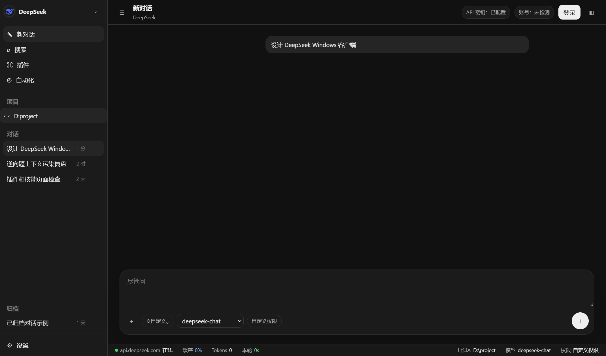
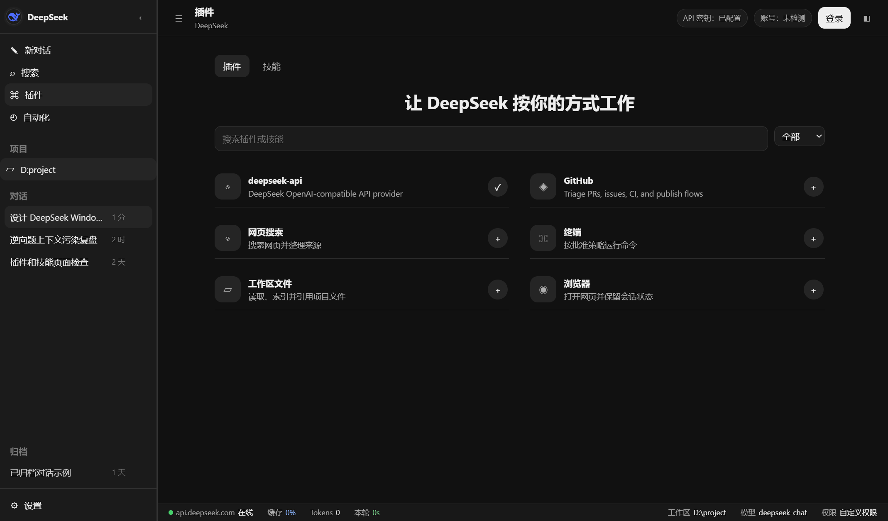
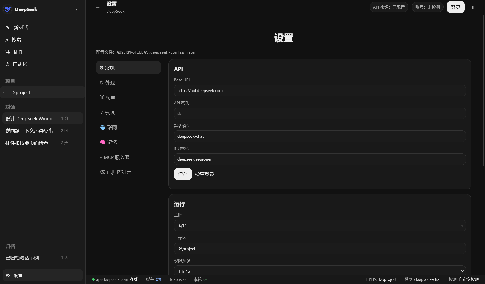

# deepseekdesktop (rubbish)

> Status: UI shell mostly sketched, but the product is not reliable. This repository is published as an unfinished prototype and a cautionary example, not as a usable agent.

## What this is

`deepseekdesktop` is an experimental Windows desktop + CLI wrapper around the DeepSeek OpenAI-compatible API.

## Screenshots

These screenshots are captured from a sanitized demo run. They show the rough UI state only; they do not imply that the underlying features are complete.








The UI interface is basically designed:

- desktop shell
- sidebar
- chat composer
- model selector
- permission selector
- settings panels
- plugin/skill placeholder pages
- right-side context/tools panel
- `.deepseek`-style config/session directory
- one-click Windows installer experiment

However, most non-UI capabilities are incomplete or unreliable.

## Current architecture

- `packages/desktop`: Electron desktop prototype.
- `packages/cli`: Node.js CLI prototype.
- `packages/desktop-ui`: React UI experiment.
- `packages/desktop-tauri`: Tauri + React migration experiment.
- `installer`: IExpress/PowerShell installer prototype.
- `docs`: design notes and migration notes.

## Severe disadvantages

### 1. Reasoning and task understanding are weak

- The agent often fails to infer the user's real goal.
- It can treat "continue", "rewrite", or "second challenge" as isolated text instead of resolving them through the previous conversation.
- It may output a plan when the user clearly wants a final answer.
- It may stop after giving commands instead of executing them through the host.
- It can repeat a disproven answer after the user has already corrected it.
- It can over-trust a previous wrong answer because the old context is still present.
- It can confuse different attached files and reuse the flag or evidence from an earlier challenge.
- It has no robust multi-step verification loop comparable to a mature coding agent.

### 2. Reverse engineering / CTF logic is unreliable

- It may stop at `strings` output instead of following xrefs, callbacks, comparison logic, and output paths.
- It may hallucinate disassembly or claim command output that was not actually produced by the host.
- It may invent flags when the binary evidence is incomplete.
- It may fail to distinguish candidate strings from verified flags.
- It may analyze the wrong file when several challenge files exist in the conversation.
- It has only shallow deterministic PE parsing and a few ad-hoc heuristics.
- It is not a replacement for Ghidra, IDA, x64dbg, angr, radare2, Binary Ninja, or proper dynamic analysis.

### 3. Tool execution is incomplete

- The desktop host can run some PowerShell commands, but orchestration is primitive.
- There is no safe, mature, persistent terminal/PTY layer.
- Command approval and permission behavior is only roughly modeled.
- "Full access" is not the same as elevated administrator access.
- Binary, archive, image, pcap, and ISO handling depend on whatever tools exist locally.
- Missing tools are not installed or routed automatically in a robust way.

### 4. File and attachment handling is incomplete

- File drag/drop and attachment UX is basic.
- Large files are truncated.
- There is no full binary artifact pipeline.
- There is no dependable workspace indexer.
- Context selection can still be wrong in long conversations.
- Personal/runtime files must be excluded manually before publishing.

### 5. UI is only a prototype

- Layout and animation are partly implemented but not polished.
- Right-side tools are incomplete.
- Plugin and skill pages are mostly placeholder UI.
- Settings pages exist but many controls do not drive real back-end behavior.
- Scroll, resizing, overflow, and small-window behavior may still break.
- Theme handling is not production quality.
- Accessibility has not been audited.

### 6. Login and account handling are incomplete

- DeepSeek does not currently provide a Codex-style desktop OAuth integration here.
- Web login only opens `https://chat.deepseek.com/`; it does not grant API access.
- API calls require a DeepSeek API key.
- Account state is superficial and should not be considered secure auth.

### 7. Memory, archive, and persistence are unfinished

- `.deepseek` directory creation exists, but the memory model is shallow.
- Conversation archive logic is incomplete.
- Session indexing is primitive.
- There is no durable semantic memory layer.
- There is no reliable project-level knowledge base.

### 8. Security model is not production ready

- Permission presets are UI-level/host-level conventions, not a hardened sandbox.
- Shell command denylist is insufficient as a security boundary.
- No strong process isolation.
- No hardened secret storage.
- No comprehensive audit log.
- No mature malware/binary sandboxing.
- No update signature verification beyond the rough installer experiment.

### 9. Installer is experimental

- The installer is an IExpress/PowerShell prototype.
- It is not a polished NSIS/MSIX/Squirrel/Tauri installer.
- Shortcut creation and icon behavior may vary.
- It does not implement robust uninstall/repair/update flows.
- It may leave runtime files in the user's profile.

### 10. Tauri migration is not complete

- Tauri + React is documented as a better target architecture.
- The current Electron version remains the working prototype.
- Rust/Cargo/Tauri build parity has not been completed.
- The Tauri command layer does not yet match the Electron host features.

## What works partially

- Basic desktop launch.
- Basic CLI launch.
- API-key based DeepSeek chat calls.
- `deepseek-chat` and `deepseek-reasoner` model routing.
- Some local file reading.
- Some PowerShell host calls.
- Some deterministic binary metadata extraction.
- Basic session/config directory creation.
- Basic UI shell close to the intended visual shape.

## What does not work well

- Correct long-context reasoning.
- Consistent CTF solving.
- Reliable local tool execution.
- Deep binary analysis.
- Production permission enforcement.
- Full plugin/skill execution.
- Robust browser automation.
- OAuth login.
- Durable memory.
- Polished installer lifecycle.

## Why this is published

This repository is published to preserve the prototype state and make its weaknesses explicit. It should not be presented as a finished DeepSeek desktop client.

## Install for development

```powershell
npm install
npm run desktop
```

CLI:

```powershell
node packages\cli\bin\deepseek.js --help
```

Set API key locally:

```powershell
node packages\cli\bin\deepseek.js config set-key <your-api-key>
```

## Privacy note

This public copy intentionally excludes:

- local runtime `.deepseek` data
- session archives
- cache files
- API keys
- personal challenge notes
- `node_modules`
- installer build output
- temporary files

Do not commit your real `.deepseek` directory.

